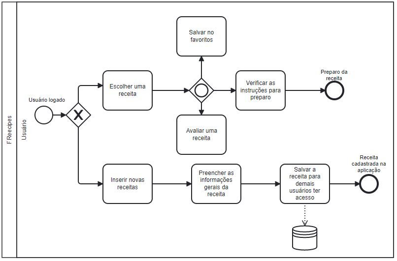

# Especificações do Projeto

Pré-requisitos: <a href="1-Documentação de Contexto.md"> Documentação de Contexto</a>

Definição do problema e ideia de solução a partir da perspectiva do usuário. É composta pela definição do  diagrama de personas, histórias de usuários, requisitos funcionais e não funcionais além das restrições do projeto.

Apresente uma visão geral do que será abordado nesta parte do documento, enumerando as técnicas e/ou ferramentas utilizadas para realizar a especificações do projeto

## Personas

Pedro Paulo tem 26 anos, é arquiteto recém-formado e autônomo. Pensa em se desenvolver profissionalmente através de um mestrado fora do país, pois adora viajar, é solteiro e sempre quis fazer um intercâmbio. Está buscando uma agência que o ajude a encontrar universidades na Europa que aceitem alunos estrangeiros.

Enumere e detalhe as personas da sua solução. Para tanto, baseie-se tanto nos documentos disponibilizados na disciplina e/ou nos seguintes links:

> **Links Úteis**:
> - [Rock Content](https://rockcontent.com/blog/personas/)
> - [Hotmart](https://blog.hotmart.com/pt-br/como-criar-persona-negocio/)
> - [O que é persona?](https://resultadosdigitais.com.br/blog/persona-o-que-e/)
> - [Persona x Público-alvo](https://flammo.com.br/blog/persona-e-publico-alvo-qual-a-diferenca/)
> - [Mapa de Empatia](https://resultadosdigitais.com.br/blog/mapa-da-empatia/)
> - [Mapa de Stalkeholders](https://www.racecomunicacao.com.br/blog/como-fazer-o-mapeamento-de-stakeholders/)
>
Lembre-se que você deve ser enumerar e descrever precisamente e personalizada todos os clientes ideais que sua solução almeja.

## Histórias de Usuários

Com base na análise das personas forma identificadas as seguintes histórias de usuários:

|EU COMO... `PERSONA`| QUERO/PRECISO ... `FUNCIONALIDADE` |PARA ... `MOTIVO/VALOR`                 |
|--------------------|------------------------------------|----------------------------------------|
|Usuário do sistema  | Registrar minhas tarefas           | Não esquecer de fazê-las               |
|Administrador       | Alterar permissões                 | Permitir que possam administrar contas |

Apresente aqui as histórias de usuário que são relevantes para o projeto de sua solução. As Histórias de Usuário consistem em uma ferramenta poderosa para a compreensão e elicitação dos requisitos funcionais e não funcionais da sua aplicação. Se possível, agrupe as histórias de usuário por contexto, para facilitar consultas recorrentes à essa parte do documento.

> **Links Úteis**:
> - [Histórias de usuários com exemplos e template](https://www.atlassian.com/br/agile/project-management/user-stories)
> - [Como escrever boas histórias de usuário (User Stories)](https://medium.com/vertice/como-escrever-boas-users-stories-hist%C3%B3rias-de-usu%C3%A1rios-b29c75043fac)
> - [User Stories: requisitos que humanos entendem](https://www.luiztools.com.br/post/user-stories-descricao-de-requisitos-que-humanos-entendem/)
> - [Histórias de Usuários: mais exemplos](https://www.reqview.com/doc/user-stories-example.html)
> - [9 Common User Story Mistakes](https://airfocus.com/blog/user-story-mistakes/)

## Modelagem do Processo de Negócio 

### Análise da Situação Atual

Atualmente uma pessoa quando deseja fazer uma receita podemos considerar que a mesma irá recorrer a livros de receitas, acompanhar em programas de culinária, redes sociais e até mesmo comprar ebooks que são vendidos por professionais da área, tais como: nutricionista, nutrólogo, influencer fitness entre outros. Com uma busca na internet também é possível encontrar, mas devido à grande diversidade de receitas corre o risco do seu foco desviar para outras receitas gerais. 

### Descrição Geral da Proposta

É uma aplicação especializada na culinária fit, com foco em opções fitness e saudáveis, criamos esse projeto, onde o objetivo é o próprio usuário conseguir inserir suas receitas e também poder visualizar á de outros usuários e pratica-lás. Devido a possibilidade de publicar, o acervo sempre terá receitas novas para serem feitas. Ter variedades de cardápio em um só lugar para ajudar na dieta, facilitar em definir o que comer em cada refeição e agilizar na sua rotina é o nosso diferencial para te ajudar nessa tarefa de seguir uma boa alimentação. 

### Processo 1 – MODELAGEM AS IS
O AS-IS é a situação atual dos processos, ou seja, como os processos funcionam hoje. Sem realizar nenhuma análise crítica e sem discutir se o processo está bom ou ruim.

### Processo 2 – MODELAGEM TO BE - FREECIPE
O TO-BE é o processo futuro, ou seja, ele é o processo melhorado, aquele processo que queremos que a empresa venha a seguir. Ele é o processo onde as melhorias estão sendo implementadas. 

## Indicadores de Desempenho

Apresente aqui os principais indicadores de desempenho e algumas metas para o processo. Atenção: as informações necessárias para gerar os indicadores devem estar contempladas no diagrama de classe. Colocar no mínimo 5 indicadores. 

Usar o seguinte modelo: 

Obs.: todas as informações para gerar os indicadores devem estar no diagrama de classe a ser apresentado a posteriori. 

## Requisitos

Ao começar um projeto todos os requisitos devem ser levantados, entendidos e documentado. O escopo deste projeto é definido por meio de requisitos funcionais, que são as características que definem os critérios de aceitação do produto e a necessidade do cliente, e requisitos não funcionais que é voltado pelas características de qualidade que o sistema todo ou uma funcionalidade em específico deve ter.
Para determinar a prioridade de requisitos, aplicamos o método MoSCoW, é uma técnica usada em gestão, análise de negócios, desenvolvimento de software e gerenciamentos de projetos. Ela é utilizada para definir a prioridade e a importância das tarefas que compõem um projeto, é entendida como um acrônimo e cada uma das sua classificações origina-se no inglês. A seguir, apresentamos a ordem de importância:

- Must Have (tenho que fazer)
- Should Have (devo fazer)
- Could Have (poderia fazer)
- Won’t Have (não será feito "por enquanto")

As tabelas que se seguem apresentam os requisitos funcionais e não funcionais do projeto, identificando a prioridade em que os mesmos devem ser entregues. 
### Requisitos Funcionais

|ID    | Descrição do Requisito  | Prioridade |
|------|-----------------------------------------|----|
|RF-01 | Permitir cadastrar um usuário  | MUST | 
|RF-02 | Efetuar login  | MUST | 
|RF-03 | Permitir excluir usuário  | MUST |
|RF-04 | Implementar uma Web API | MUST | 
|RF-05 | Permitir ao usuário inserir receitas.   | MUST |
|RF-06 | Permitir ao usuário atualizar as receitas cadastradas  | MUST | 
|RF-07 | Permitir ao usuário excluir receitas   | MUST |
|RF-08 | Permitir pesquisar receitas. | SHOULD | 
|RF-09 | Salvar lista de favoritos.   | COULD |
|RF-10 | Permitir aos usuarios visualizar todas as receitas da aplicação  |  MUST |
|RF-11 | Ordenar as receitas por categoria.   | COULD |
|RF-12 | Permitir ao usuário avaliar outras receitas.    | COULD |

### Requisitos não Funcionais

|ID     | Descrição do Requisito  |Prioridade |
|-------|-------------------------|----|
|RNF-01 | Segurança na criação de usuário, a necessidade de criptografia de senhas e demais questões relacionadas para garantir a proteção dos dados.   | MUST | 
|RNF-02 | Informar ao usuário quais são os campos de preenchimento obrigatório. |  MUST | 
|RNF-03 | Utilizar símbolo e ícone para ajudar no entendimento e conseguir uma associação imediata sobre aplicações de reconhecimento.  |  WON'T |
|RNF-04 | A aplicação deve ser intuitiva, de fácil utilização, entendimento e deve ser organizado de tal maneira que os erros dos usuários sejam minimizados.     |  COULD |
|RNF-05 | A aplicação deve possuir uma interface limpa, com visualização voltada para as necessidades do usuário no momento, também como forma de melhorar a performance e o desempenho.   |  COULD |
|RNF-06 | A aplicação ou parte dela deve ser acessível por todo tipo de pessoas: idosos, PCD ou necessidade específica.  |  COULD |
|RNF-07 | A aplicação deverá ser responsiva.   |  SHOULD|

## Restrições

|ID| Restrição                                             |
|--|-------------------------------------------------------|
|RE-01| O projeto deverá ser entregue no final do semestre letivo, não podendo extrapolar a data de 25/06/2023.|
|RE-02| A equipe não pode subcontratar o desenvolvimento do trabalho.      |

## Diagrama de Casos de Uso

O diagrama de casos de uso é o próximo passo após a elicitação de requisitos, que utiliza um modelo gráfico e uma tabela com as descrições sucintas dos casos de uso e dos atores. Ele contempla a fronteira do sistema e o detalhamento dos requisitos funcionais com a indicação dos atores, casos de uso e seus relacionamentos. 

As referências abaixo irão auxiliá-lo na geração do artefato “Diagrama de Casos de Uso”.

> **Links Úteis**:
> - [Criando Casos de Uso](https://www.ibm.com/docs/pt-br/elm/6.0?topic=requirements-creating-use-cases)
> - [Como Criar Diagrama de Caso de Uso: Tutorial Passo a Passo](https://gitmind.com/pt/fazer-diagrama-de-caso-uso.html/)
> - [Lucidchart](https://www.lucidchart.com/)
> - [Astah](https://astah.net/)
> - [Diagrams](https://app.diagrams.net/)

# Matriz de Rastreabilidade

A matriz de rastreabilidade é uma ferramenta usada para facilitar a visualização dos relacionamento entre requisitos e outros artefatos ou objetos, permitindo a rastreabilidade entre os requisitos e os objetivos de negócio. 

A matriz deve contemplar todos os elementos relevantes que fazem parte do sistema, conforme a figura meramente ilustrativa apresentada a seguir.

> **Links Úteis**:
> - [Artigo Engenharia de Software 13 - Rastreabilidade](https://www.devmedia.com.br/artigo-engenharia-de-software-13-rastreabilidade/12822/)
> - [Verificação da rastreabilidade de requisitos usando a integração do IBM Rational RequisitePro e do IBM ClearQuest Test Manager](https://developer.ibm.com/br/tutorials/requirementstraceabilityverificationusingrrpandcctm/)
> - [IBM Engineering Lifecycle Optimization – Publishing](https://www.ibm.com/br-pt/products/engineering-lifecycle-optimization/publishing/)

# Gerenciamento de Projeto

De acordo com o PMBoK v6 as dez áreas que constituem os pilares para gerenciar projetos, e que caracterizam a multidisciplinaridade envolvida, são: Integração, Escopo, Cronograma (Tempo), Custos, Qualidade, Recursos, Comunicações, Riscos, Aquisições, Partes Interessadas. Para desenvolver projetos um profissional deve se preocupar em gerenciar todas essas dez áreas. Elas se complementam e se relacionam de tal forma que não se deve apenas examinar uma área de forma estanque. É preciso considerar, por exemplo, que as áreas de Escopo, Cronograma e Custos estão muito relacionadas. Assim, se eu amplio o escopo de um projeto eu posso afetar seu cronograma e seus custos.

## Gerenciamento de Tempo

Com diagramas bem organizados que permite gerenciar o tempo nos projetos, o gerente de projetos agenda e coordena tarefas dentro de um projeto para estimar o tempo necessário de conclusão.

### Timing visão geral

### Timing visão parcial 1 de 3

### Timing visão parcial 2 de 3

### Timing visão parcial 3 de 3

O gráfico de Gantt ou diagrama de Gantt também é uma ferramenta visual utilizada para controlar e gerenciar o cronograma de atividades de um projeto. Com ele, é possível listar tudo que precisa ser feito para colocar o projeto em prática, dividir em atividades e estimar o tempo necessário para executá-las.

## Gerenciamento de Equipe

O gerenciamento adequado de tarefas contribuirá para que o projeto alcance altos níveis de produtividade. Por isso, é fundamental que ocorra a gestão de tarefas e de pessoas, de modo que os times envolvidos no projeto possam ser facilmente gerenciados. 

## Gestão de Orçamento

O processo de determinar o orçamento do projeto é uma tarefa que depende, além dos produtos (saídas) dos processos anteriores do gerenciamento de custos, também de produtos oferecidos por outros processos de gerenciamento, como o escopo e o tempo.

