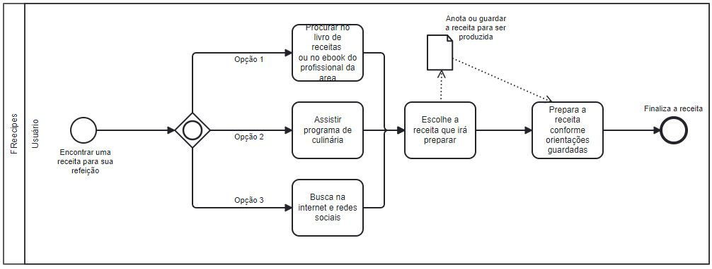

# Especificações do Projeto

Definição do Problema:
Encontrar receitas fitness e saudáveis em sites de culinária é um desafio, especialmente quando se trata de uma plataforma que permita aos usuários compartilhar suas próprias receitas. Este projeto visa solucionar esse problema, criando uma rede social de receitas fitness e saudáveis que permita aos usuários cadastrados compartilhar suas próprias receitas, editá-las, excluí-las e atualizá-las.

Ideia de Solução:
Desenvolver um site e aplicativo de culinária que se concentre em receitas fitness e saudáveis, permitindo que os usuários compartilhem suas próprias receitas, e que sejam capazes de editá-las, excluí-las, atualizá-las e avaliá-las. O site e o aplicativo serão criados usando o Asp.Net Core MVC e o React Native/Snack Expo, respectivamente. Ferramentas de comunicação, como o Microsoft Teams e o WhatsApp, serão utilizadas para a comunicação da equipe. Ferramentas para criação de diagramas, como o Diagramas.net, e para desenho de tela (wireframe), como o Figma, serão usadas para auxiliar no desenvolvimento do projeto.

## Personas

## Ana Souza
| **Informações Pessoais** | **Sites e Aplicativos** | **Motivações** |
| --- | --- | --- |
| Idade:  30 anos | Instagram | Ajudar seus clientes a alcançarem seus objetivos de forma saudável. |
| Estado Civil: Casada  | MyFitnessPal | Receber recomendações personalizadas. |
| Naturalidade: São Paulo, SP  | | |
| Tipo de moradia atual: Apartamento | | |
| Cidade em que reside atualmente: São Paulo	 | | |
| Formação: Educação Física	 | | |
| Ocupação: Personal Trainer	 | | |

| **Frustração:**| **Hobbies:**|
| --- | --- |
| Dificuldade em encontrar ingredientes específicos para receitas. | Praticar exercícios físicos e cozinhar.  | - |

## Pedro Santos
| **Informações Pessoais** | **Sites e Aplicativos** | **Motivações** |
| --- | --- | --- |
| Idade:  35 anos | Instagram | Experimentar novas receitas e incentivar uma alimentação saudável. |
| Estado Civil: Solteiro | YouTube | Aprender a preparar novos pratos com ingredientes diferentes |
| Naturalidade: Rio de Janeiro, RJ | | |
| Tipo de moradia atual: Casa | | |
| Cidade em que reside atualmente: Rio de Janeiro | | |
| Formação: Gastronomia | | |
| Ocupação: Chef de cozinha | | |

| **Frustração:**| **Hobbies:**|
| --- | --- |
| Fornercer pratos mais saudáveis em seu restaurante. | Experimentar novas receitas | - |

## Maria Albuquerque
| **Informações Pessoais** | **Sites e Aplicativos** | **Motivações** |
| --- | --- | --- |
| Idade:  28 anos | Instagram | Ajudar seus pacientes a atingirem seus objetivos de saúde. |
| Estado Civil: Solteira | Google | Compartilhar suas receitas com seus clientes. |
| Naturalidade: Belo Horizonte, MG | Keep | |
| Tipo de moradia atual: Apartamento | | |
| Cidade em que reside atualmente: Belo Horizonte | | |
| Formação: Nutrição | | |
| Ocupação: Nutricionista | | |

| **Frustração:**| **Hobbies:**|
| --- | --- |
| Alunos que não se comprometem com a dieta e exercícios. | Ciclismo | - |

## João Nunes
| **Informações Pessoais** | **Sites e Aplicativos** | **Motivações** |
| --- | --- | --- |
| Idade:  25 anos | Stack Overflow | Se manter saudável em meio a uma rotina agitada. |
| Estado Civil: Solteiro | GitHub | Aprender novas técnicas e receitas de culinária |
| Naturalidade: Porto Alegre, RS | 9gag | |
| Tipo de moradia atual: Apartamento | | |
| Cidade em que reside atualmente: Porto Alegre | | |
| Formação: Engenharia de Computação | | |
| Ocupação: Desenvolvedor de software | | |

| **Frustração:**| **Hobbies:**|
| --- | --- |
| Falta de tempo para cozinhar e a rotina corrida de trabalho | Programação e desenvolvimento de projetos pessoais. | - |

## Bruno Fonseca
| **Informações Pessoais** | **Sites e Aplicativos** | **Motivações** |
| --- | --- | --- |
| Idade: 43 anos | Twitter | Conciliar trabalho e alimentação saudável. |
| Estado Civil: Casado | Instagram | |
| Naturalidade: Campinas, SP |  | |
| Tipo de moradia atual: Apartamento | | |
| Cidade em que reside atualmente: Campinas | | |
| Formação: Administração	 | | |
| Ocupação: Empresário | | |

| **Frustração:**| **Hobbies:**|
| --- | --- |
| Falta de tempo para preparar refeições saudáveis, ausência de opções práticas e fáceis de fazer. | Música e viagens. | - |

## Mariana Lima
| **Informações Pessoais** | **Sites e Aplicativos** | **Motivações** |
| --- | --- | --- |
| Idade: 35 anos | Instagram | Manter uma alimentação saudável e equilibrada. |
| Estado Civil: Casada | TikTok | Encontrar receitas práticas e rápidas de fazer |
| Naturalidade: São Paulo, SP |  | |
| Tipo de moradia atual: Casa | | |
| Cidade em que reside atualmente: São Paulo | | |
| Formação: Ensino Médio	 | | |
| Ocupação: Dona de casa | | |

| **Frustração:**| **Hobbies:**|
| --- | --- |
| Falta de variedade nas refeições. | Praticar exercícios físicos na academia. | - |

## Lucas Monteiro
| **Informações Pessoais** | **Sites e Aplicativos** | **Motivações** |
| --- | --- | --- |
| Idade: 36 anos | Instagram |  Ter uma alimentação saudável e equilibrada. |
| Estado Civil: Solteiro | Twitter | Compartilhar suas receitas com amigos e familiares. |
| Naturalidade: João Pessoa, PB |  | |
| Tipo de moradia atual: Apartamento | | |
| Cidade em que reside atualmente: João Pessoa | | |
| Formação: Direito	 | | |
| Ocupação: Advogado | | |

| **Frustração:**| **Hobbies:**|
| --- | --- |
| Restrições alimentares por conta de sua saúde. | Cozinhar receitas sofisticadas e experimentais. | - |

## Histórias de Usuários

Com base na análise das personas forma identificadas as seguintes histórias de usuários:

|EU COMO... `PERSONA`| QUERO/PRECISO ... `FUNCIONALIDADE` |PARA ... `MOTIVO/VALOR`                 |
|--------------------|------------------------------------|----------------------------------------|
Ana Souza | Quero poder cadastrar minha conta no aplicativo, efetuar login, excluir minha conta e ter a segurança dos meus dados protegidos com criptografia de senhas e outras medidas de segurança | Para ter uma experiência segura e confiável no uso da plataforma. |
Pedro Santos | Quero poder inserir, atualizar e excluir minhas próprias receitas | Para poder organizar minhas opções e ter um registro delas disponível. |
Maria Albuquerque | Quero poder pesquisar receitas por nome, categoria ou ingrediente | Para encontrar opções específicas e personalizadas de acordo com minhas preferências. |
João Nunes | Quero poder salvar minhas receitas favoritas em uma lista de favoritos. | Para poder acessá-las facilmente posteriormente. |
Mariana Lima | Quero poder avaliar outras receitas. | Para compartilhar minha opinião e ajudar outros usuários na escolha das opções. |
Lucas Monteiro | Quero ser informado sobre quais campos de preenchimento são obrigatórios. | Para não deixar informações importantes em branco. |
Bruno Fonseca | Quero uma interface intuitiva e organizada, com símbolos e ícones claros e de fácil entendimento. | Para minimizar erros e facilitar o uso da plataforma. |
João Nunes | Quero uma interface limpa, que priorize a visualização das informações mais relevantes no momento e que seja responsiva | Para melhorar a performance e o desempenho da aplicação. |
Maria Albuquerque | Quero uma aplicação acessível para todo tipo de pessoa, incluindo idosos, PCD e pessoas com necessidades específicas. | Para garantir a acessibilidade e inclusão de todos. |

## Modelagem do Processo de Negócio 

### Análise da Situação Atual

Atualmente uma pessoa quando deseja fazer uma receita podemos considerar que a mesma irá recorrer a livros de receitas, acompanhar em programas de culinária, redes sociais e até mesmo comprar ebooks que são vendidos por professionais da área, tais como: nutricionista, nutrólogo, influencer fitness entre outros. Com uma busca na internet também é possível encontrar, mas devido à grande diversidade de receitas corre o risco do seu foco desviar para outras receitas gerais. 

### Descrição Geral da Proposta

É uma aplicação especializada na culinária fit, com foco em opções fitness e saudáveis, criamos esse projeto, onde o objetivo é o próprio usuário conseguir inserir suas receitas e também poder visualizar á de outros usuários e pratica-lás. Devido a possibilidade de publicar, o acervo sempre terá receitas novas para serem feitas. Ter variedades de cardápio em um só lugar para ajudar na dieta, facilitar em definir o que comer em cada refeição e agilizar na sua rotina é o nosso diferencial para te ajudar nessa tarefa de seguir uma boa alimentação. 

### Processo 1 – MODELAGEM AS IS
O AS-IS é a situação atual dos processos, ou seja, como os processos funcionam hoje. Sem realizar nenhuma análise crítica e sem discutir se o processo está bom ou ruim.

### Processo 2 – MODELAGEM TO BE - FREECIPE
O TO-BE é o processo futuro, ou seja, ele é o processo melhorado, aquele processo que queremos que a empresa venha a seguir. Ele é o processo onde as melhorias estão sendo implementadas. 

## Indicadores de Desempenho

Principais indicadores de desempenho e algumas metas para o processo.

## Requisitos

Ao começar um projeto todos os requisitos devem ser levantados, entendidos e documentado. O escopo deste projeto é definido por meio de requisitos funcionais, que são as características que definem os critérios de aceitação do produto e a necessidade do cliente, e requisitos não funcionais que é voltado pelas características de qualidade que o sistema todo ou uma funcionalidade em específico deve ter.
Para determinar a prioridade de requisitos, aplicamos o método MoSCoW, é uma técnica usada em gestão, análise de negócios, desenvolvimento de software e gerenciamentos de projetos. Ela é utilizada para definir a prioridade e a importância das tarefas que compõem um projeto, é entendida como um acrônimo e cada uma das sua classificações origina-se no inglês. A seguir, apresentamos a ordem de importância:

- Must Have (tenho que fazer)
- Should Have (devo fazer)
- Could Have (poderia fazer)
- Won’t Have (não será feito "por enquanto")

As tabelas que se seguem apresentam os requisitos funcionais e não funcionais do projeto, identificando a prioridade em que os mesmos devem ser entregues. 
### Requisitos Funcionais

|ID    | Descrição do Requisito  | Prioridade |
|------|-----------------------------------------|----|
|RF-01 | Permitir cadastrar um usuário  | MUST | 
|RF-02 | Efetuar login  | MUST | 
|RF-03 | Permitir excluir usuário  | MUST |
|RF-04 | Permitir ao usuário inserir receitas.   | MUST |
|RF-05 | Permitir ao usuário atualizar as receitas cadastradas  | MUST | 
|RF-06 | Permitir ao usuário excluir receitas   | MUST |
|RF-07 | Permitir pesquisar receitas. | SHOULD | 
|RF-08 | Salvar lista de favoritos.   | COULD |
|RF-09 | Permitir aos usuarios visualizar todas as receitas da aplicação  |  MUST |
|RF-10 | Ordenar as receitas por categoria.   | COULD |
|RF-11 | Permitir ao usuário avaliar outras receitas.    | COULD |

### Requisitos não Funcionais

|ID     | Descrição do Requisito  |Prioridade |
|-------|-------------------------|----|
|RNF-01 | Segurança na criação de usuário, a necessidade de criptografia de senhas e demais questões relacionadas para garantir a proteção dos dados.   | MUST | 
|RNF-02 | Informar ao usuário quais são os campos de preenchimento obrigatório. |  MUST | 
|RNF-03 | Utilizar símbolo e ícone para ajudar no entendimento e conseguir uma associação imediata sobre aplicações de reconhecimento.  |  WON'T |
|RNF-04 | A aplicação deve ser intuitiva, de fácil utilização, entendimento e deve ser organizado de tal maneira que os erros dos usuários sejam minimizados.     |  COULD |
|RNF-05 | A aplicação deve possuir uma interface limpa, com visualização voltada para as necessidades do usuário no momento, também como forma de melhorar a performance e o desempenho.   |  COULD |
|RNF-06 | A aplicação ou parte dela deve ser acessível por todo tipo de pessoas: idosos, PCD ou necessidade específica.  |  COULD |
|RNF-07 | A aplicação deverá ser responsiva.   |  SHOULD|

## Restrições

|ID| Restrição                                             |
|--|-------------------------------------------------------|
|RE-01| O projeto deverá ser entregue no final do semestre letivo, não podendo extrapolar a data de 25/06/2023.|
|RE-02| A equipe não pode subcontratar o desenvolvimento do trabalho.      |

## Diagrama de Casos de Uso

# Matriz de Rastreabilidade

A matriz de rastreabilidade é uma ferramenta usada para facilitar a visualização dos relacionamento entre requisitos e outros artefatos ou objetos, permitindo a rastreabilidade entre os requisitos e os objetivos de negócio. 

A matriz deve contemplar todos os elementos relevantes que fazem parte do sistema, conforme a figura meramente ilustrativa apresentada a seguir.

> **Links Úteis**:
> - [Artigo Engenharia de Software 13 - Rastreabilidade](https://www.devmedia.com.br/artigo-engenharia-de-software-13-rastreabilidade/12822/)
> - [Verificação da rastreabilidade de requisitos usando a integração do IBM Rational RequisitePro e do IBM ClearQuest Test Manager](https://developer.ibm.com/br/tutorials/requirementstraceabilityverificationusingrrpandcctm/)
> - [IBM Engineering Lifecycle Optimization – Publishing](https://www.ibm.com/br-pt/products/engineering-lifecycle-optimization/publishing/)

# Gerenciamento de Projeto

De acordo com o PMBoK v6 as dez áreas que constituem os pilares para gerenciar projetos, e que caracterizam a multidisciplinaridade envolvida, são: Integração, Escopo, Cronograma (Tempo), Custos, Qualidade, Recursos, Comunicações, Riscos, Aquisições, Partes Interessadas. Para desenvolver projetos um profissional deve se preocupar em gerenciar todas essas dez áreas. Elas se complementam e se relacionam, de tal forma que não se deve apenas examinar uma área de forma estanque. É preciso considerar, por exemplo, que as áreas de Escopo, Cronograma e Custos estão muito relacionadas. Assim, se eu amplio o escopo de um projeto eu posso afetar seu cronograma e seus custos.

## Gerenciamento de Tempo

Com diagramas bem organizados que permitem gerenciar o tempo nos projetos, o gerente de projetos agenda e coordena tarefas dentro de um projeto para estimar o tempo necessário de conclusão.

### Timing visão geral

### Timing visão parcial 1 de 3

### Timing visão parcial 2 de 3

### Timing visão parcial 3 de 3

O gráfico de Gantt ou diagrama de Gantt também é uma ferramenta visual utilizada para controlar e gerenciar o cronograma de atividades de um projeto. Com ele, é possível listar tudo que precisa ser feito para colocar o projeto em prática, dividir em atividades e estimar o tempo necessário para executá-las.

## Gerenciamento de Equipe

O gerenciamento adequado de tarefas contribuirá para que o projeto alcance altos níveis de produtividade. Por isso, é fundamental que ocorra a gestão de tarefas e de pessoas, de modo que os times envolvidos no projeto possam ser facilmente gerenciados. 

## Gestão de Orçamento

O processo de determinar o orçamento do projeto é uma tarefa que depende, além dos produtos (saídas) dos processos anteriores do gerenciamento de custos, também de produtos oferecidos por outros processos de gerenciamento, como o escopo e o tempo.

