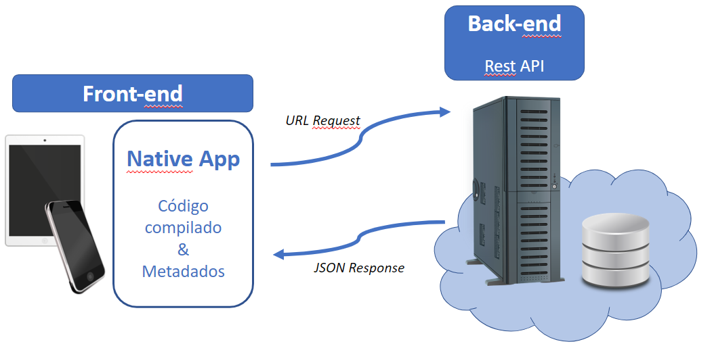

# Arquitetura da Solução

Pré-requisitos: <a href="3-Projeto de Interface.md"> Projeto de Interface</a>

Definição de como o software é estruturado em termos dos componentes que fazem parte da solução e do ambiente de hospedagem da aplicação.

## Diagrama de Classes

Em programação, um diagrama de classes é uma representação da estrutura e relações das classes que servem de modelo para objetos. Podemos afirmar de maneira mais simples que seria um conjunto de objetos com as mesmas características, assim saberemos identificar objetos e agrupá-los, de forma a encontrar suas respectivas classes. 

> 

## Modelo ER

O Esquema Relacional corresponde à representação dos dados em tabelas juntamente com as restrições de integridade e chave primária.

Na figura abaixo é mostrado o Esquema Relacional(ER).

## Esquema Relacional

O Esquema Relacional corresponde à representação dos dados em tabelas juntamente com as restrições de integridade e chave primária.

Na figura abaixo é mostrado o Esquema Relacional(ER).

## Modelo Físico

Os scripts da criação das tabelas do banco se encontram na pasta src\bd

[Direcionamento para o SQL](https://github.com/ICEI-PUC-Minas-PMV-ADS/pmv-ads-2023-1-e4-proj-infra-t1-time2-receita/blob/main/src/bd/FreecipeDB.sql)

## Tecnologias Utilizadas

Para o desenvolvimento, utilizaremos a mesma tecnologia utilizada pelo professor nas videoaulas, o Visual Studio 2022, para a hospedagem utilizaremos o GitHub.
Será utilizado  para o desenvolvimento web Back-end  o framework ASP.NET, com a linguagem de programação C#, para o desenvolvimento mobile usaremos o framework React Native do JavaScript.

Para o desenvolvimento do Front-end utilizaremos o HTML e css, para os diagramas utilizamos o diagrams.net, e para os templates utilizamos os Figma.

## Hospedagem

A hospedagem do nosso site e aplicativo será no Vercel, e o nosso Back-end será hospedado no banco de dados SQL do azure.

## Qualidade de Software

Conceituar qualidade de fato é uma tarefa complexa, mas ela pode ser vista como um método gerencial que através de procedimentos disseminados por toda a organização, busca garantir um produto final que satisfaça às expectativas dos stakeholders.

No contexto de desenvolvimento de software, qualidade pode ser entendida como um conjunto de características a serem satisfeitas, de modo que o produto de software atenda às necessidades de seus usuários. Entretanto, tal nível de satisfação nem sempre é alcançado de forma espontânea, devendo ser continuamente construído. Assim, a qualidade do produto depende fortemente do seu respectivo processo de desenvolvimento.

A norma internacional ISO/IEC 25010, que é uma atualização da ISO/IEC 9126, define oito características e 30 subcaracterísticas de qualidade para produtos de software.
Com base nessas características e nas respectivas sub-características, identifique as sub-características que sua equipe utilizará como base para nortear o desenvolvimento do projeto de software considerando-se alguns aspectos simples de qualidade. Justifique as subcaracterísticas escolhidas pelo time e elenque as métricas que permitirão a equipe avaliar os objetos de interesse.

> **Links Úteis**:
>
> - [ISO/IEC 25010:2011 - Systems and software engineering — Systems and software Quality Requirements and Evaluation (SQuaRE) — System and software quality models](https://www.iso.org/standard/35733.html/)
> - [Análise sobre a ISO 9126 – NBR 13596](https://www.tiespecialistas.com.br/analise-sobre-iso-9126-nbr-13596/)
> - [Qualidade de Software - Engenharia de Software 29](https://www.devmedia.com.br/qualidade-de-software-engenharia-de-software-29/18209/)
